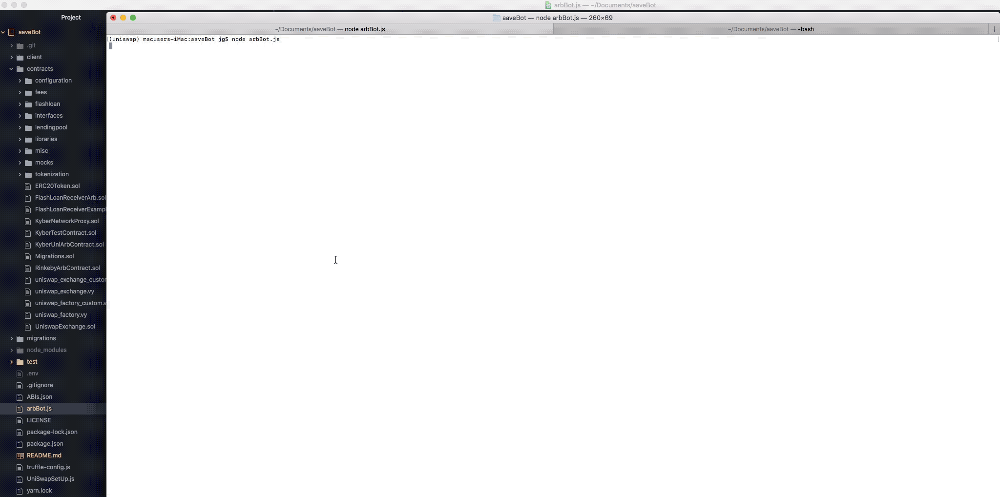

## Intro

A bot that does arbitrage between two Uniswap exchanges using an [Aave Flashloan](https://developers.aave.com/#what-is-aave) as the capital for initial trade.



Note - I keep getting sporadic 'Invalid liquidity available' errors with Aave FlashLoan that makes it tricky to test but following info should detail what I've done.

## Custom UniSwap SetUp

Initial plan was to do a Kyber/Uni Arb function and use Aave Flashloan as the source of capital for the trade. Unfortunately the Aave reserve tokens don't match Kybers so I couldn't continue with this (see below for Kyber code details). To overcome this I decided to adapt the UniSwap contracts to allow two exchanges with the same token pool to be created, in this case an Eth/DAI pool. This way I can create an Arb opportunity by manually trading one pool and not the other. The arbBot will detect the opportunity and execute the trades atomically via an on-chain smart contract which in this case also uses the FlashLoan to fund the trade.

See uniswap_factory_custom.vy and uniswap_exchange_custom.vy for the custom contracts.

## Code Details

All smart contracts can be found in ./contracts folder, including Aave contracts.
* FlashLoanReceiverArb.sol is the main contract that receives flash loan and executes UniSwap trades.
* uniswap_factory_custom.vy and uniswap_exchange_custom.vy are the UniSwap custom contracts.
* arbBot.js - this is the main Arb bot that is checking for an Arb opportunity between the two UniSwap pools. If an opportunity is found FlashLoanArb function calls the FlashLoan.
* UniSwapSetUp.js - This is a helper script. setUp() will deploy 2 UniSwap pools with equal liquidity. TradeEthToToken and TradeTokenToEth functions execute a manual trade via web3 to unbalance the pools and create an Arb op.
* ./test folder - has a number of scripts that test UniSwap/Aave functionality.
* testAave.js has some useful testers for interacting with FlashLoan (see below for more info)
* .test/testUniSwap.js: This tester script will: display the trader address eth and token balance, Display UniSwap pool information (Default DAI/Eth pool), Display UniSwap pool spot trade price, Calculate and display UniSwap effective price for Eth -> Token (0.001Eth), Execute Eth -> Token trade.

Truffle used as framework because it's easy to write, test and deploy contracts, etc.

Previously setup Vyper so that UniSwap contracts can be compiled. ($ pyenv activate uniswap)

To Deploy to Kovan:
* Check ./migrations/2_deploy_contracts.js is configured to deploy required contracts.
* Run: $ truffle deploy --network kovan
* Then run $ node UniSwapSetUp.js to create exchanges with Pool.

## Aave Integration & FlashLoan Implementation

To integrate Aave into my Truffle project I did the following:

* Imported all contracts from github: https://github.com/aave/aave-protocol into my contracts folder
* $ yarn add openzeppelin-solidity
* Now you should be able to $ truffle compile

FlashLoan:

There is a basic tutorial in the Aave [docs](https://developers.aave.com/#tutorials) but from what I saw on Discord this is a bit of confusion for some people of how it works so I've detailed the steps I used just to confirm operation using the DAI reserve:

1. The smart contract that you want to receive/use the FlashLoan must inherit from the FlashLoanReceiverBase contract. See ./contracts/FlashLoanReceiverExample.sol for my VERY basic example. In this contract all I have added is an event that gets emitted, borrowMade, when the executeOperation function is called. Normally this is where you would enter your own logic that uses the funds from the flash loan.
2. Deploy your smart contract and make sure to note the address.
3. Because there is a 1% fee paid on any FlashLoan the smart contract needs some DAI to pay this. Normally this would come from profit from exectuting an Arb op or similar but in this example the contract isn't doing anything to make a profit so it needs to have some extra DAI.
4. Go to https://testnet.aave.com/faucet and get some DAI. Then send some DAI to the contract address from step 2.
5. The [LendingPool FlashLoan function](https://developers.aave.com/#lendingpool) first parameter is the receiver address - in this case it is your smart contract address from step 2. When the FlashLoan is executed it will call your smart contract function and execute.
6. Below is some pseudo code that demonstrates how the flash loan is called using Web3. The complete code can be found in ./test/testAave.js and can be run with your own information.

```
const LendingPoolAddressesProviderInstance = new web3.eth.Contract(LendingPoolAddressesProvider.abi, '0x9C6C63aA0cD4557d7aE6D9306C06C093A2e35408');
const lendingPool = await LendingPoolAddressesProviderInstance.methods.getLendingPool().call();

const LendingPoolInstance = new web3.eth.Contract(LendingPool.abi, lendingPool);

var receiverContract = '0xb544f44905dBc94e096576898debAD22b6A2F3C1';    // Address of your deployed contract from step 2.
var reserveAddr = '0xFf795577d9AC8bD7D90Ee22b6C1703490b6512FD';         // This is the DAI address and it is confirmed as working
var loanAmountWei = web3.utils.toWei('0.001', 'ether');

const reserveData = await LendingPoolInstance.methods.getReserveData(reserveAddr).call();
console.log('Reserve Data: ');
console.log(reserveData);                                             // This shows how much reserve funds are available

const tx =  LendingPoolInstance.methods.flashLoan(receiverContract, reserveAddr, loanAmountWei); // Actual flashLoan call with your contract as the receiver.
console.log('Sending tx');
var rx = await Util.sendTransaction(web3, tx, TRADER_ACCOUNT_ADDR, process.env.PRIVATEKEY, lendingPool);
console.log(rx)

```


## Some Other Info That Might Help People

https://faucet.kovan.network

https://kovan.etherscan.io/

https://testnet.aave.com/faucet

The hard coded fee for an Aave FlashLoan is 1%.

Aave Reserve Info:

['Ampleforth',
 '0xd2eC3a70EF3275459f5c7a1d5930E9024bA3c4f3',
 'Basic Attention Token',
 '0x2d12186Fbb9f9a8C28B3FfdD4c42920f8539D738',
 'DAI',
 '0xFf795577d9AC8bD7D90Ee22b6C1703490b6512FD',
 'Ethereum',
 '0x804C0B38593796bD44126102C8b5e827Cf389D80',
 'Kyber Network',
 '0x3F80c39c0b96A0945f9F0E9f55d8A8891c5671A8',
 'LEND',
 '0x1BCe8A0757B7315b74bA1C7A731197295ca4747a',
 'ChainLink',
 '0xAD5ce863aE3E4E9394Ab43d4ba0D80f419F61789',
 'Decentraland',
 '0x738Dc6380157429e957d223e6333Dc385c85Fec7',
 'Maker',
 '0x61e4CAE3DA7FD189e52a4879C7B8067D7C2Cc0FA',
 'Augur',
 '0x260071C8D61DAf730758f8BD0d6370353956AE0E',
 'Synthetix USD',
 '0xD868790F57B39C9B2B51b12de046975f986675f9',
 'TrueUSD',
 '0x1c4a937d171752e1313D70fb16Ae2ea02f86303e',
 'USD Coin',
 '0xe22da380ee6B445bb8273C81944ADEB6E8450422',
 'USDT Coin',
 '0x13512979ADE267AB5100878E2e0f485B568328a4',
 'WBTC Coin',
 '0x3b92f58feD223E2cB1bCe4c286BD97e42f2A12EA',
 '0x Coin',
 '0xD0d76886cF8D952ca26177EB7CfDf83bad08C00C']


## Kyber/UniSwap Implementation

Initial plan was to do a Kyber/Uni Arb function and use Aave Flashloan as the source of funds for the trade. Unfortunately the Aave reserve tokens don't match Kybers so I couldn't continue with this. Might be an idea to try and match ERC20 tokens across protocols as most of these benefit from composability.

Kept code as it may be useful. Main contract is found in /contracts/KyberUniArbContract.sol.
* By default the address that deploys the contract is the owner.
* UniSwap requires approval to trade tokens on behalf of owner. approveToken function is called for this. Only the contract owner can approve tokens. (Has to be an ERC20 token!)
* trade function executes a trade. At the moment this does Eth->ERC20 via Kyber then ERC20->Eth via UniSwap which also sends the Eth to the msg.sender.
* Should be easy to drop in Balancer functions.
